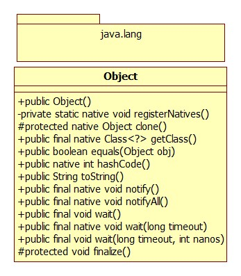

# Java Object类方法

https://www.cnblogs.com/lwbqqyumidi/p/3693015.html

Object类是Java中其他所有类的祖先，没有Object类Java面向对象无从谈起，作为其他所有类的基类，Object具有哪些属性和行为，是Java语言设计背后的思维体现。

Object类位于java.lang包中，java.lang包包含着Java最基础和核心的类，在编译时会自动导入。Object类没有定义属性，一共有13个方法，结构图如下：



## 类构造器public Object()

大部分情况下，Java中通过形如new A(args...)形式创建一个属于该类型的对象。其中A即是类名，A(args...)即此类定义中相对应的构造函数。通过此种形式创建的对象都是通过类中的构造函数完成。为体现此特性，Java中规定：在类定义中，对于为定义构造函数的类，默认会有一个无参构造函数。作为所有类的基类，Ojbect类自然要反映出此特性，在源码中，未给出Object类构造函数定义，但实际上，此构造函数是存在的。

当然，并不是所有的类都是通过此中方式去构建，自然，并不是所有的类构造函数都是public。


## private static native void registerNatives()

函数前面有native关键字修饰，Java中，用native关键字修饰的函数表明该方法的实现并不是在java中去完成，而是由c/c++去完成，并被编译成了.dll，由java去调用。方法的具体实现体在dll文件中，对于不同平台，其具体实现应该有所不同。用native修饰，即表示操作系统，需要提供此方法，Java本身需要使用。具体到registerNatives方法本身，其主要作用是**将c/c++中的方法映射到java中的native方法，实现方法命名的解耦**。

```java
private static native void registerNatives();
static{
    registerNatives();
}
```

## protected native Object clone() throws CloneNotSupportException;

clone()方法也是一个native方法，因此，clone方法并不是java原生方法，具体的实现是由c/c++完成的。其目的是创建并返回此对象的一个副本。你克隆出的对象，和被克隆的对象没有任何关系。clone函数返回的是一个引用，指向的是新的clone出来的对象，此对象与原对象分别占用不同的堆空间。

```java
public class ObjectTest{
    public static void main(String[] args){
        Object o1 = new Object();
        //The method clone() from the type Object is not visible
        Object clone = o1.clone();
    }
}
```

这里报错The method clone from the type object is not visible.

protected修饰的属性或方法：在同一个包内或者不同包的子类可以访问。

```java
public class ObjectTest{
    public static void main(String[] args){
        ObjectTest o1 = new ObjectTest();
        
        try{
            ObjectTest o2 = (ObjectTest)o1.clone();
        }catch(CloneNotSupportedException e){
            e.printStackTrace();
        }
    }
}
```

clone正确调用需要实现cloneable接口，如果没有实现cloneable接口，调用clone方法，会抛出异常。

cloneable只是一个接口，不包含任何方法，用来指示object.clone可以合法的被子类引用所调用

```java
public class ObjectTest implements Cloneable{
    public static void main(String[] args){
        ObjectTest o1 = new ObjectTest();
        
        try{
            ObjectTest o2 = (ObjectTest)o1.clone();
            System.out.print("o2:"+o2);
        }catch(CloneNotSupportedException e){
            e.printStackTrace();
        }
    }
}
```

## public final native Class<?> getClass();

getClass也是一个native方法，返回的是此Object对象的类对象/运行时类对象Class<?>.效果与Object.class相同.

- 类对象:在Java中，类是对具有一组相同特征或行为的示例的抽象并进行描述，对象则是此类所描述的特征或行为的具体实例。作为概念层次的类，其本身也具有某些共同的特性，如都具有类名称，由类加载器去加载，都具有包，具有父类，属性和方法等。于是，Java中由专门定义了一个类，Class，去描述其他类所具有的这些特性，因此，从此角度去看，类本身也都是属于Class类的对象。


## public boolean equals(Object obj)

== 与equals在Java中经常被使用，==与equals的区别：

==表示的是变量值完全相同（对于基础类型，地址中存储的是值，引用类型则存储指向实际对象的地址）

equals表示的是对象的内容完全相同，此处的内容多指对象的特征/属性。(常见与String类中)

Object类中关于equals的方法

```java
publuic boolean equals(Object obj){
    return (this == obj);
}
```

由此可见，Object原声的equals发方法内部调用的是==，为什么要定义此equals方法？？？

equals方法的正确理解：判断两个对象是否相等。那么判断对象相等的标尺又是什么???

```java
public class User{
    private int uid;
    private String name;
    private int age;
	//get&&set
    
    @Override
    public boolean equals(Object obj){
        if(obj == null || !(obj instanceof User)){
            return false;
        }
        if((User)obj.getUid() == this.getUid()){
            return true;
        }
        return false;
    }
}
```

```java
public class ObjectTest implements Cloneable{
    public static void main(String[] args){
        User u1 = new User();
        u1.setUid(111);
        u1.setName("张三");
        
        User u2 = new User();
        u2.setUid(111);
        u2.setName("sdfdf");
        
        System.out.println(u1.equals(u2));
    }
}
```

Java中的约定:重写equals方法必须重写hashCode方法


## public native int hashCode();

hashcode方法返回一个整数，表示该对象的哈希码值。

hashcode具有如下约定：

- 在java应用程序执行期间，对于同一对象多次调用hashCode方法时，其返回的哈希码是相同的，前提是将对象进行equals比较时所用的标尺信息未做修改。在java应用程序的一次执行到另外一次执行，同一对象的hashcode返回的哈希码无需保持一致。
- 如果两个对象相等，那么这两个对象调用hashcode返回的哈希码也必须相等
- 反之，两个对象掉哦那个hashcode返回的哈希码相等，这两个对象不一定相等。

严格的数学逻辑：两个对象相等 <==> equals相等 ==> hashcode相等。因此重写equals方法必须重写hashcode方法，以保证此逻辑严格成立，同时可以推理出：hashcode不相等 ==> equals不相等 <==> 两个对象不相等。

hashCode 的作用：主要用于增强哈希表的性能。

以集合类中set为例，当新加一个对象时，需要判断现有集合中是否已经存在与此对象相等的对象，如果没有hashCode方法，需要将set进行一次遍历，并逐一用equals方法判断两个对象是否相等，此种算法事件复杂度为o(n)。通过借助于hashCode方法，先计算出即将加入对象的哈希码，然后根据哈希算法计算出此对象的位置，直接判断此位置上是否已有对象即可。(set的底层用的是map的原理实现)

对象的hashCode返回的不是对象所在的物理内存地址。甚至也不一定是对象的逻辑地址，hashCode相同的两个对象，不一定相等，换言之，不相等的两个对象，hashCode返回的哈希码可能相同。

```java
public class User{
    private int uid;
    private String name;
    private int age;
    //get&&set
    
    @Override
    public boolean equals(Object obj){
        if(obj == null || !(obj instanceof User)){
            return false;
        }
        if(((User)obj).getUid() == this.getUid()){
            return true;
        }
        return false;
    }
    
    @Override
    public int hashCode(){
        int result = 17;
        result = 31*result + this.getUid();
        return result;
    }
}
```

上述hashCode重写中出现了result*31是因为result *31 = (result<<5) - result.之所以选择31，是因为左移晕眩和减运算计算效率大于乘法效率。当然也可以选择其他数字。


## public String toString();

toString()方法返回该对象的字符串表示。

```java
public String toString(){
    return getClass().getName() + "@" +Integer.toHexString(hashCode());
}
```

getClass返回对象的类对象，getClassName以String形式返回类对象的名称（含包名）。

Integer.toHexString(hashCode())则是以对象的哈希码为实参，以16进制无符号整数形式返回此哈希码的字符串表示形式

```text
同一类型不同对象调用toString方法返回的结果可能相同。
```

## wait()/notify()/notifyAll()...

这几个方法主要用于java多线程之间的协作。

- wait（）：调用此方法所在的当前线程等待，直到在其他线程上调用此方法的主调的notify（）/notifyAll（）方法
- wait（long time）/wait（long time，int nanos）：调用此方法所在的当前线程等待，直到在其他线程上效用此方法的主调的notify/notifyAll（）方法，或超过指定的超时时间量。
- notify（）/notifyAll()：唤醒在此对象监视器上等待的单个线程/所有线程。
- wait()/notify()/notifyAll()一般情况下是配套使用

```java
public class ThreadTest{
    public static void main(String[] args){
        MyRunnable r = new MyRunnable();
        Thread t = new Thread(r);
        t.start();
        
        synchronized(r){
            try{
                System.out.println("main thread 等待t线程执行完");
                r.wait();
                System.out.println("被notify唤醒，得以继续执行");
            }catch(InterruptedException e){
                e.printStackTrace();
                System.out.println("main thread本想等待，但被意外打断了");
            }
            System.out.println("线程t执行相加结果：" + r.getTotal());
        }
    }
}

class MyRunnable implements Runnable{
    private int total;
    
    @Override
    public void run(){
        Synchronized(this){
            System.out.println("Thread name is :" + Thread.currentThread().getName());
            for(int i = 0;i < 10;i++){
                total += i;
            }
            notify();
            System.out.println("执行notify后同步代码块中依然可以继续执行完毕");
        }
        System.out.println("执行notify后同步代码块外的代码执行时机取决于线程调度");
    }
    
    public int getTotal(){
        return total;
    }
}
```

任何对象都可以视为线程同步中的监听器，且wait()/notify()/notifyAll()方法只能在同步代码块中使用.

- wait(...)方法调用后当前线程将立即阻塞，且释放其所持有的同步代码块中的锁，直到被唤醒或超时或打断后重新获取到锁后才能继续执行。
- notify()/notifyAll()方法调用后，其所在线程不会立即释放所持有的锁，直到其所在同步代码块中的代码执行完毕，此时释放锁，因此，如果其同步代码块后还有代码，其执行则依赖于JVM的线程调度。

wait具体定义

```java
public final void wait() throws InterruptedException{
    wait(0);
}
```

且wait(long timeout,int nanos)方法定义内部实质上也是通过调用wait(long timeout)完成的，而wait(long timeout)是一个native方法，因此wait()本质上都是native实现

notify()/notifyAll()也都是native实现

## protected void finalize()

finalize方法主要与Java垃圾回收机制有关。

```java
protected void finalize() throws Throwable{}
```

空方法，

首先，Object中定义finalize方法表明Java中每一个对象都将具有finalize这种行为，其具体调用时机在：JVM准备对此对象所占用的内存控件进行垃圾回收前，将被调用。此方法并不是我们主动调用的。


## 补充-为什么wait()/notify()/notifyAll()方法必须在同步代码块中调用

- 在Java中，所有对象都能被作为监视器monitor------指一个**拥有一个独占锁，一个入口队列和一个等待队列**的实体entity。所有对象的非同步方法都能够在任意时刻被任意线程调用，因此不需要考虑加锁的问题。而对于对象的同步方法来说，在任意时刻有且仅有一个拥有该对象独占锁的线程能够调用那个它们。例如，一个同步方法是独占的。如果在线程调用某一对象的同步方法时，对象的独占锁被其他线程拥有，那么当前线程将处于阻塞状态，并添加到对象的入口队列中。

- 当一个线程正在某一个对象的同步方法中运行时调用了这个对象的wait()方法，那么这个线程将释放该对象的独占锁并被放入这个对象的等待队列。注意，**wait()方法强制当前线程释放对象锁**。这意味着在**调用某对象的wait()方法之前，当前线程必须已经获得该对象的锁**。因此，线程必须在某个对象的同步方法或同步代码块中才能调用该对象的wait()方法.
- 当某线程调用某对象的notify()/notifyAll()方法时，任意一个或者所有在该对象的等待队列中的线程，将被转移到该对象的入口队列。接着这些队列将竞争该对象的锁，获得锁的线程继续执行。如果没有线程在该对象的等待队列中，那么notify()和notifyAll()将不起任何作用。在调用对象的notify()和notifyAll()方法之前，调用线程必须已经得到该对象的锁。因此，必须在某个对象的同步方法或同步代码块中才能调用该对象的notify()和notifyAll()方法。
- 调用wait()方法的原因通常是，调用线程希望某个特殊的状态被设置之后再继续执行。调用notify方法的原因通常是，调用线程希望告诉其他等待中的线程：特殊状态已经被设置。这个状态作为线程间通信的通道，他必须是一个可变的共享状态。


## 补充------wait与sleep的区别

- sleep方法是Thread类的静态方法，不涉及到线程间同步的概念，仅仅为了让一个线程自身获得一段沉睡时间。sleep可以再任何地方使用
- wait方法是object类的方法，解决的问题是线程间的同步，该过程包含了同步锁的获取和释放，调用wait方法会将调用者的线程挂起，直到其他线程调用同一对象的notify方法才会重新激活调用者。

```java
线程调用notify后，只有该线程完全从synchronized代码里面执行完毕后，monitor才会被释放，被唤醒线程才可以真正得到执行权。
```

