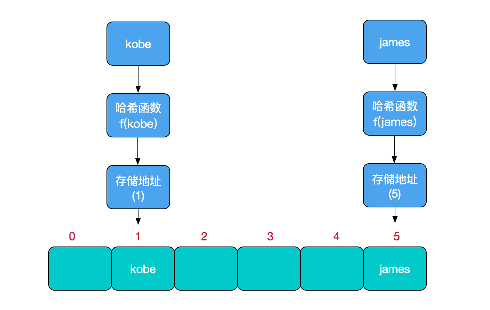
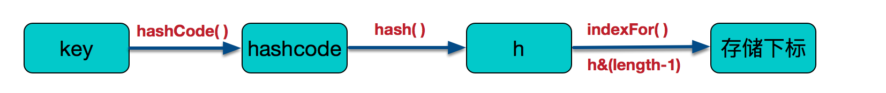
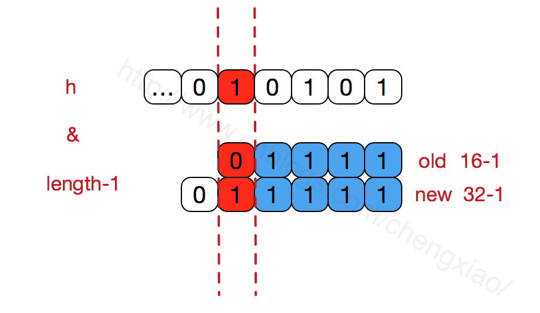

# HashMap实现原理

https://www.cnblogs.com/chengxiao/p/6059914.html

哈希表(hash table)也叫散列表，是一种非常重要的数据结构，应用场景及其丰富，许多缓存技术(memcached)的核心其实就是再内存中维护一张大的哈希表。

## 什么是哈希表

### 数据结构

- 数组：采用一段连续的存储单元来存储数据。对于指定下标的查找，时间复杂度为o(1);通过给定值进行查找，需要便利数组，逐一对比给定关键字和数组元素，时间复杂度为o(n),当然，对于有序数组，则可采用二分查找，插值查找，斐波拉契查找，可将查找复杂度提高为o(logn);对于一般的插入删除操作，涉及到数组元素的移动，其平均复杂度也为o(n)
- 线性链表：对于链表的新增，删除等操作，仅需处理节点间的引用即可，时间复杂度为o(1),而查找操作需要遍历链表逐一进行比对，复杂度o(n)
- 二叉树：对一颗相对平衡的有序二叉树，对其进行插入，查找，删除等操作，平均复杂度为o(logn)
- 哈希表：相比上述几种数据结构，再哈希表中添加，删除，查找等操作，性能十分之高，不考虑哈希冲突的情况下，仅需一次定位即可完成，时间复杂度为o(1)

数据结构的物理存储结构只有两种：顺序存储结构和链式存储结构，而再上面我们提到过，再数组中根据下表查找某个元素，一次定位就可以达到，哈希表利用了这种特性，哈希表的主干就是数组。

比如我们要新增或查找某个元素，我们通过吧当前元素的关键字 通过某个函数映射到数组中的某个位置，通过数组下标一次定位就可完成操作。

​		存储位置 = function(关键字);

其中，这个函数一般称为哈希函数，这个函数的设计好坏会直接影响到哈希表的优劣。



- 哈希冲突:如果两个不同的元素，通过哈希函数得出的时机存储地址相同怎么办，也就是说，当我们对某一个元素进行哈希运算，得到一个存储地址，然后要进行插入的时候，发现已经被其他元素占用了，其实这就是所谓的哈希冲突，也叫哈希碰撞。好的哈希函数会尽可能的保证计算简单和散列地址分布均匀，但是我们需要清楚的是，数组是一块连续的固定长度的内存控件，再好的哈希函数也不能保证得到的存储地址绝不发生冲突。那么哈希重提如何解决呢？开放定址法(发生冲突，继续寻找下一块未被占用的存储地址)，再散列函数法，链地址法，而Hashmap即是采用了链地址法，也就是数组+链表的方式。

## HashMap实现原理

HashMap的主干是一个Entry数组。Entry是HashMap的基本组成单元，每一个Entry包含一个key-value键值对。

```java
//HashMap的主干数组，可以看到就是一个Entry数组，初始值为空数组{}，主干数组的长度一定是2的次幂。
transient Entry<K,V>[] table = (Entry<K,V>[])EMPTY_TABLE;
```

Entry是HashMap中的一个静态内部类

```java
static class Entry<K,V> implements Map.Entry<K,V>{
    final K key;
    V value;
    Entry<K,V> next;//存储指向下一个Entry的引用，单链表结构
    int hash;//对key的hashcode值进行hash运算后得到的值，存储在Entry，避免重复计算
    
    Entry(int h,K k,V v,Entry<K,V> n){
        value = v;
        key = k;
        hash = h;
        next = n;
    }
}
```

所以,HashMap的整体结构如下，


**简单来说，HashMap由数组+链表组成的，数组是HashMap的主体，链表则是主要为了解决哈希冲突而存在的，如果定位到的数组位置不含链表，那么对于查找，添加等操作很快，仅需一次寻址即可；如果定位到的驻足包含链表，对于添加操作，其时间复杂度为o(n),首先便利链表，存在即覆盖，否则新增；对于查找操作来讲，仍需便利链表，然后通过key对象的equals方法逐一比对查找。所以性能考虑，HashMap中的链表出现越少，性能才会越好。**

其他几个重要字段

```java
//实际存储的key-value键值对的个数
transient int size;
//阈值，当table == {}时，该值为初始容量，16，当table被填充了，也就是为table分配内存空间后，threshold一般为capacity*loadFactory。HashMap在进行扩容时需要参考threshold。
int threshold；
//负载因子，代表了table的填充度有多少，默认时0.75
final float loadFactory；
//由于快速失败，由于HashMap非线程安全，在对HashMap进行迭代时，如果期间其他线程的参与导致HashMap的结构法神了变化，需要抛出异常ConcurrentModificationException
transient int modCount；
```

HashMap有4个构造器，其他构造器如果用户没有传入initialCapacity和loadFactory这两个参数，会使用默认值initialCapacity--16，loadFactory--0.75

```java
public HashMap(int initialCapacity,float loadFactory){
    //此处对传入的初始容量进行校验，最大不能超过MAXIMUM_CAPACITY = 1<<30   (2e30)
    if(initialCapacity < 0){
        throw new IllegalArgumentException("Illegal initial capacity:" + initialCapacity);
    }
    if(initialCapacity > MAXIMUM_CAPACITY){
        initialCapacity = MAXIMUM_CAPACITY;
    }
    if(loadFactory<=0 || Float.isNaN(loadFactory)){
        throw new IllegalArgumentException...
    }
    this.loadFactory = loadFactory;
    threshold = initialCapacity;
    
    init();//init方法在hashMap中没有实际实现，不过在其子类如linkedHashmap中就有对应实现
}
```

在常规构造器中，没有为数组table分配内存空间，而是在执行put操作的时候才真正构建table数组

```java
public V put(K key,V value){
    //如果table数组为空数组，进行数组填充（为table分配实际内存空间），入参为threshold,此事threshold为initialCapacity默认时1<<4 (16)
    if(table == EMPTY_TABLE){
        inflateTable(threshold);
    }
    //如果key为null，存储位置为table[0]或table[0]的冲突链上
    if(key == null){
        return putForNullKey(value);
    }
    int hash = hash(key);//对key的hashcode进一步计算，确保散列均匀
    int i = indexFor(hash,table.length);//获取在table中的实际位置
    for(Entry<K,V> e = table[i];e!= null; e = e.next){
        Object k;
        if(e.hash == hash && ((k = e.key) == key || key.equals(k))){
            V oldValue = e.value;
            e.value = value;
            e.recordAccess(this);
            return oldValue;
        }
    }
    modCount ++;//保证并发访问时，若HashMap内部结构发生变化，快速相应失败
    addEntry(hash,key,value,i);//新增一个entry
    return null；
}
```

inflateTable

```java
private void inflateTable(int toSize){
    int capacity = roundUpToPowerOf2(toSize);//capacity一定时2的次幂
    threshold = (int)Math.min(capacity*loadFactory,MAXIMUM_CAPACITY +1)//此处为threshold赋值，取capacity*loadFactory和MAXIMUM_CAPACITY+1的最小值，capacity一定不会超过MAXIMUM_CAPACITY,除非loadFactory大于1.
    table = new Entry[capacity];
    initHashSeedAsNeeded(capacity);
}
```

inflateTable这个方法用于为主干数组table在内存中分配存储空间，通过roundUpToPowerOf2(toSize)可以确保capacity为大于或等于toSize的最接近toSize的二次幂，比如toSize=13，则capacity=16，to_size=16，capacity=16，toSize=17，capacity=32；

```java
private static int roundUpToPowerOf2(int number){
    return number >= MAXIMUM_CAPACITY
        ? MAXIMUM_CAPACITY
        : (number > 1) ? Integer.highestOneBit((number-1) << 1) : 1;
}
```

roundUpToPowerOf2中的这段处理使得数组长度一定为2的次幂，Integer.highestOneBit时用来获取最左边的bit（其他bit位为0）所代表的数值。

hash函数

```java
//该函数用了很多的异或，移位等运算，对key的hashcode进一步进行计算以及二进制位的调整来保证最终获取的存储位置尽量分布均匀
final int hash(Object k){
    int h = hashSeed;
    if(0 != h && k instanceof String){
        return sun.misc.Hashing.stringHash32((String)k);
    }
    h ^= k.hashCode();
    h ^= (h >>>20 ) ^ (h >>>12);
    return h ^ (h >>>7 ) ^ (h >>>4);
}
```

以上hash函数计算出的值，通过indexFor进一步处理来获取实际的存储位置

```java
static int indexFor(int h,int length){
    return h & (length-1);
}
```

保证获取的index一定在数组范围内，默认容量16，长度length-1 = 15，如果h=18

```text
	1	0	0	1	0
&	0	1	1	1	1
________________________
	0	0	0	1	0	= 2
```

最终存储位置的确定流程时这样的：



addEntry的实现

```java
void addEntry(int hash,K key,V value,int bucketIndex){
    if((size >= threshold) && (null != table[bucketIndex])){
        resize(2*table.length);//当size超过临界阈值threshold，并且即将发生哈熟悉冲突时进行扩容
        hash = (null != key) ? hash(key) : 0;
        bucketIndex = indexFor(hash,table.length);
    }
    
    createEntry(hash,key,value,bucketIndex);
}
```

当发生哈希冲突并且size大于阈值的时候，需要进行数组扩容，扩容时，需要新建一个长度为之前数组2倍的新的数组，然后将当前的Entry数组中的元素全部传输过去，扩容后的新数组长度为之前的2倍，所以扩容相对来说是个耗资源的操作。

## 为何HashMap的数组长度一定是2的次幂

resize方法

```java
void resize(int newCapacity){
    Entry[] oldTable = table;
    int oldCapacity = oldTable.length;
    if(oldCapacity == MAXIMUM_CAPACITY){
        threshold = Integer.MAX_VALUE;
        return;
    }
    
    Entry[] newTable = new Entry[newCapacity];
    transfer(newTable,initHashSeedAsNeeded(newCapacity));
    table = newTable;
    threshold = (int)Math.min(newCapacity * loadFactory,MAXIMUM_CAPACITY + 1);
}
```

如果数组进行扩容，数组长度发生变化，而存储位置index = h & (length-1),index也可能会发生变化，需要重新计算index,我们先来看看transfer这个方法

```java
void transfer(Entry[] newTable,boolean rehash){
    int newCapacity = newTable.length;
    //for循环中的代码，逐个遍历链表，重新计算索引位置，将老数组数据复制到新数组中去(数组不存储实际数据，所以仅仅是拷贝引用而已)
    for(Entry<K,V> e:table){
        while(null != e){
            Entry<K,V> next = e.next;
            if(rehash){
                e.hash = null == e.key? 0 : hash(e.key);
            }
            int i = indexFor(e.hash,newCapacity);
 			//将当前entry的next链指向新的索引位置，newTable[i]有可能为空，也有可能是个entry链，如果是entry链，直接在链表头部插入           
            e.next = newTable[i];
            newTable[i] = e;
            e = next;
        }
    }
}
```

​	这个方法将老数组中的数据逐个链表地遍历，扔到新的扩容后的数组中，我们的数组索引位置的计算是通过对key值的hashcode进行hash扰乱运算后，再通过和length-1进行位运算得到最终数组索引位置。

​	hashmap的数组长度一定保持2的次幂，比如16的二进制表示为10000，那么length-1就是15，二进制为01111，同理扩容后的数组长度32，100000，length-1为31，011111.这样会保证低位全为1，而扩容后只有一位差异，也就是多处了最左位的1，这样再通过h&(length-1)的时候，只要h对应的最左边的哪一个差异位为0，就能保证得到的新的数组索引和老数组索引一致，(大大减少了之前已经散列良好的老数组的数据位置重新调换)



还有，数组长度保持2的次幂，length-1的低位都为1，会使得获得的数组索引index更加均匀


我们看到，上面的&运算，高为是不会对结果产生影响的(hash函数采用各种位运算可能也是为了使得低位更加散列)，我们只关注低位bit，如果低位全部为1，那么对于h低位部分来说，任何一位的变化都会对结果产生影响，也就是说，要的到index=21这个存储位置，h的低位只有这一种组合。这也是数组长度设计必须为2的次幂的原因


如果不是2的次幂，也就是低位不是全为1时，要使得index=21，h的低位部分不再具有唯一性了，哈希冲突的几率会变的更大，同时，index对应的这个bit位不论如何不会等于1了，而对应的那些数组位置也就被白白浪费了。

get

```java
public V get(Object key){
    
    if(key == null){
        return getForNullKey();
    }
    Entry<K,V> entry = getEntry(key);
    return null == entry ? null : entry.getValue();
}
```

get方法通过key值返回对应value，如果key位null，直接去table[0]出检索。

getEntry

```java
final Entry<K,V> getEntry(Object key){
    if(size == 0){
        return null;
    }
    //通过key的hashcode值计算hash值
    int hash = (key == null) ? 0 : hash(key);
    //indexFor(hash&length-1)获取最终数组索引，然后遍历链表，通过equals方法比较找出对应记录
    for(Entry<K,V> e = table[indexFor(hash,table.length];e!=null;e=e.next){
        Object k;
        if(e.hash == hash && ((k = e.key) == key || (key != null && key.equals(k)))){
            return e;
        }
        return null;
    }
    
}
```

可以看出，get方法的实现相对简单，key(hashcode) -->hash -->indexFor -->最终索引位置，找到对应位置table[i],再查看是否有链表，遍历链表，通过key的equals方法比对查找对应的记录。要注意的是，有人觉得上面再定位到数组位置之后然后遍历链表的时候，e.hash == hash这个判断没必要，仅仅通过equals判断就可以。其实不然，试想一下，如果传入的key对象重写了equals方法却没有重写hashcode，而恰巧此对象定位到这个数组位置，如果仅仅用equals判断可能是相等的，但其hashcode和当前对象不一致，这种情况，根据object的hashcode约定，不能返回当前对象，而应该返回null

## 重写equals方法需同时重写hashCode方法

如果不重写会发生什么问题

```java
public class MyTest{
    private static class Person{
        int idCard;
        String name;
        public Person(int idCard,String name){
            this.idCard = idCard;
            this.name = name;
        }
        @Override
        public boolean equals(Object o){
            if(this == o){
                return true;
            }
            if(o == null || getClass() != o.getClass()){
                return false;
            }
            Person person = (Person)o;
            //两个对象是否等值，通过idCard来确定
            return this.idCard == person.idCard;
        }
    }

    public static void main(String[] args){
        HashMap<Person,String> map = new HashMap<>();
        Person person = new Person(123,"aaa");
        map.put(person,"bbb");
        //get取出，逻辑上将应该可以输出"bbb"
        Syso(map.get(new Person(123,"aaa")));
    }
}
```

实际输出null

如果我们已经对HashMap的原理有了一定了解，这个结果就不难理解了，尽管我们再进行get和put操作的时候，使用的key从逻辑上来将是等值的，但是没有重写hashCode方法，所以操作时，key(hashCode1)-->hash-->indexFor-->最终索引位置，而通过key取出value的时候key(hashCode2)-->hash-->indexFor-->最终索引位置，由于hashcode1不等于hashcode2，导致没有定位到一个数组位置而返回逻辑上错误的值null。

​	所以再重写equals方法的时候，必须注意重写hashcode方法，同时还要保证通过equals判断相等的两个对象，调用hashcode方法也要返回相同的值。而如果equals判断不相等的两个对象，其hashcode可以相同。


