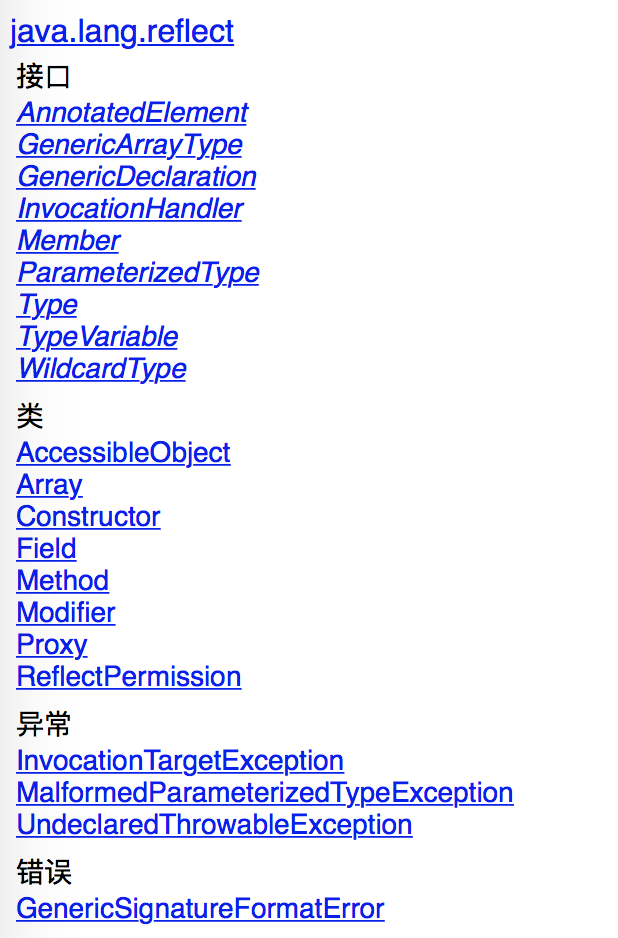

# 浅谈java反射机制

## 什么是反射

Java反射机制是在运行状态中,对于任意一个类,都能够知道这个类的所有属性和方法;对于任意一个对象,都能够调用它的任意方法和属性;这种动态获取信息以及动态调用对象方法的功能成为java语言的反射机制

## 初探

加载数据库驱动时会这样写:Class.forName("com.mysql.jdbc.Driver")

反射涉及的类,除了Class类之外,基本上都在java.lang.reflect包里面,常用的类有Constructor,Field,Method等,AccessibleObject类是前面三个类的基类,主要包含设置安全性检查等方法.



## 初始化

User类

```java
public class User{
    private String name = "init";
    private int age;
    public User(String name,int age){
        super();
        this.name = name;
        this.age = age;
    }
    private String getName(){
        return name;
    }
    private int getAge(){
        return age;
    }
    private void setName(String name){
        this.name = name;
    }
    private void setAge(int age){
        this.age = age;
    }
    @Override
    public String toString(){
        return "User [name="+name+",age="+age+"]";
    }
}
```

Test类

```java
public class ReflectTest{
    private static Class<User> userClass = User.class;
}
```

## 类

在类加载的时候,jvm会创建一个class对象

class对象是可以说是反射中最常用的,获取class对象的方式的主要有三种

- 根据类名 : 类名.class
- 根据对象: 对象.getClass()
- 根据全限定类名: Class.forName(全限定类名)

```java
public void classTest(){
    logd("根据类名:" + User.class);
    logd("根据对象:" + new User().getClass());
    logd("根据全限定类名:" + Class.for("com.zhoulesin.base.User"));
    
    //Class 常用方法
    logd("获取全限定类名:" + userClass.getName());
    logd("获取类名:" + userClass.getSimpleName());
    logd("实例化:" + userClass.newInstance());
}
```

## 构造函数

构造函数是java创建对象的必经之路,所以通过反射拿到一个类的构造函数后,再去创建这个类的对象自然是易如反掌,

```java
public void constructorTest(){
    //获取全部的构造函数
    Constructor<?>[] constructors = userClass.getConstructors();
    //取消安全性检车,设置后才可以使用private 修饰的构造函数,也可以单独对某个构造函数进行设置
    //Constructor.setAccessible(constructors,true);
    for(int i=0;i<constructors.length;i++){
        Class<?> parameterTypesClass[] = constructors[i].getParameterTypes();
        System.out.print("第"+i+"个构造函数");
        for(int j=0;j<parameterTypesClass.length;j++){
            System.out.print(parameterTypesClass[j].getName());
        }
    }
}
```

```java
第0个构造函数 ()
第1个构造函数 (java.lang.String int)
```

```java
logd("实例化,调用无参构造:" + constructors[0].newInstance());
logd("实例化,调用有参构造:" + constructors[1].newInstance("aaa",123));
```

```java
User[name=init,age=0]
User[name=aaa,age=123]
```

## 属性

```java
public void fieldTest(){
    User user = userClass.newInstance();
    //获取当前类所有属性
    Field fields[] = userClass.getDeclaredFields();
    //获取公有属性(包括父类)
    //Field fields[] = cl.getFields();
    //取消安全性检查,设置后才可以获取或者修改private修饰的属性,也可以单独对某个属性进行设置
    Field.setAccessible(fields,true);
    for(Field field:fields){
        logd("属性名"+field.getName()+",属性值:" + field.get(user)+",属性类型:"+field.getType());
    }
    Field fieldUserName = userClass.getDeclaredField("name");
    //取消安全性检查,设置后才可以获取或者修改private修饰的属性,也可以批量对所有属性进行设置
    fieldUserName.setAccessible(true);
    filedUserName.set(user,"sdfd");
    //可以直接对private的属性赋值
    logd("修改属性后:" + user);
}
```

```java
属性名:name 属性值:init  属性类型:class java.lang.String
属性名:age 属性值:0 属性类型:int
修改属性后对象: User[name=sdfd,age=0]
```

## 方法

```java
public void methodTest(){
    User user = userClass.newInstance();
    //获取当前类的所有方法
    Method[] methods = userClass.getDeclaredMethods();
    //获取公有方法(父类)
    //Method[] methods = userClass.getMethods();
    //取消安全性检查,设置后才可以调用private修饰的方法,也可以单独对某个方法进行设置
    Method.setAccessible(methods,true);
    for(Method method:methods){
        logd("方法名:" + method.getName()+",返回类型:" + method.getReturnType().getName());
    }
}
```

```java
方法名:toString 返回类型:java.lang.String
方法名:setAge 返回类型:void
方法名:getAge 返回类型:int
方法名:getName 返回类型:java.lang.String
方法名:setName 返回类型:void
```

```java
//无参的方法
Method getMethod = userClass.getDeclaredMethod("getName");
getMethod.setAccessible(true);
logd("调用getName方法:" + getMethod.invoke(user));

//带参的方法
Method setMethod = userClass.getDeclaredMethod("setName",String.class);
setMethod.setAccessible(true);
logd("调用setName方法:" + setMethod.invoke(user,"asd"));

logd("set方法修改属性后对象:" + user);
```

```java
调用getName方法: init
调用setName方法: null
set方法修改属性后对象: User[name=asd,age=0]
```


