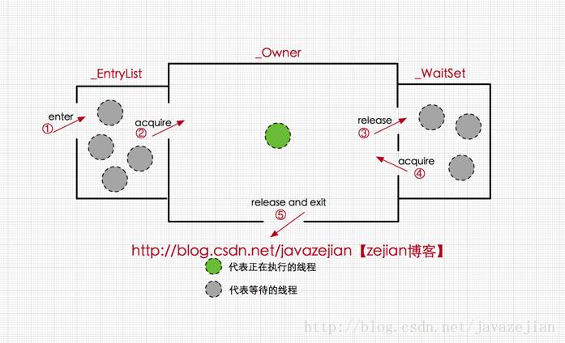

# Synchronized详解

https://blog.csdn.net/javazejian/article/details/72828483

线程安全是并发变成中的重要关注点,造成线程安全问题的主要诱因有两个

- 存在数据共享(临界资源)
- 存在多条线程共同操作共享数据

因此为了解决这个问题,我们可能需要这样一个方案,当存在多个线程操作共享数据时,需要保证同一时刻有且只有一个线程在操作共享数据,其他线程必须等到该线程处理完数据后再进行,这种方式有个高尚的名称叫互斥锁,即能达到互斥访问目的的锁,也就是说当一个共享数据被当前正在访问的线程加上互斥锁后,在同一个时刻,其他线程只能处于等待的状态,直到当前线程处理完毕释放该锁.

在java中,synchronized可以保证在同一时刻,只有一个线程可以执行某个方法或者某个代码块(主要是对方法或者代码块中存在共享数据的操作),同时我们还应该注意到synchronized另外一个重要作用,synchronized可保证一个线程的变化(主要是共享数据的变化)被其他线程所看到(保证可见性,完全可替代volatile功能).

## synchronized三种应用方式

- 修饰实例方法,作用当前实例加锁,进入同步代码前要获得当前实例的锁
- 修饰静态方法,所用当前类对象加锁,进入同步代码前要获得当前类对象的锁
- 修饰代码块,指定加锁对象,对给定对象加锁,进入同步代码前要获得给定对象的锁

### synchronized作用实例方法

所谓的实例对象锁就是用synchronized修饰实例对象中的实例方法,(不包括静态方法)

```java
public class AccountingSync implements Runnable{
    //共享资源
	static int i=0;
    
    //synchronized修饰实例方法
    public synchronized void increase(){
        i++;
    }
    
    @Override
    public void run(){
        for(int j=0;j<1000000;j++){
            increase();
        }
    }
    
    public static void main(String[] args){
        AccountingSync instance = new AccountingSync();
        Thread t1 = new Thread(instance);
        Thread t2 = new Thread(instance);
        
        t1.start();
        t2.start();
        t1.join();
        t2.join();
        
        syso(i);
    }
    
    //输出 2000000
}
```

我们开启两个线程操作同一个共享资源即变量i,由于i++,操作并不具备原子性,该操作是先读取值,然后写回一个新值,相当于原来的值加上1,分两步完成,如果第二个线程在第一个线程读取旧值和写回新值期间读取i的域值,那么第二个线程就会与第一个线程一起看到同一个值,并执行相同值得加1操作,这也就造成了线程安全失败,因此对于increase方法必须使用synchronized修饰,以便保证线程安全.

此时我们注意到synchronized修饰的是实例方法increase,在这样的情况下,当前线程的锁便是实例对象instance,注意java中线程同步锁可以是任意对象.从代码执行结果来看是正确的,倘若我们没有使用synchronized关键字,其最终输出结果就很可能小鱼2000000,这边是synchronized关键字的作用.

当一个线程正在访问一个对象的synchronized实例方法,那么其他线程不能访问该对象的synchronized方法,毕竟一个对象只有一把锁,当一个线程获取了该对象的锁之后,其他线程无法获取该对象的锁,所以无法访问该对象的其他synchronized实例方法,但是其他线程还是可以访问该实例对象的其他非synchronized方法,当然如果是一个线程A需要访问实例对象obj1的synchronized方法f1(当前对象锁是obj1),另一个线程B需要访问实例对象obj2的synchronized方法f2(当前对象锁是obj2),这样是允许的,因为两个实例对象锁并不相同,此时如果两个线程操作数据并非共享的,线程安全是有保障的,遗憾的是如果两个线程操作的是共享数据,那么线程安全就有可能无法保证了.

```java
public class AccountingSyncBad implements Runnable{
    static int i=0;
    public synchronized void increase(){
        i++;
    }
    
    @Override
    public void run(){
        for(int j=0;j<1000000;j++){
            increase();
        }
    }
    
    public static void main(String[] args){
        Thread t1 = new Thread(new AccountingSyncBad());
        Thread t2 = new Thread(new AccountingSyncBad());
        
        t1.start();
        t2.start();
        // Main线程会等待t1,t2执行完再往后执行
        t1.join();
        t2.join();
        
        syso(i);
    }
}
```

上述代码我们同时创建了两个新实例AccountingSyncBad,然后启动两个线程对共享变量i进行操作,但结果是1234444而不是2000000,因为上述代码犯了严重的错误,虽然我们使用了synchronized修饰了increase方法,但却new了连个不同的实例对象,这样就意味着存在着两个不同的实例对象锁,因此t1,t2线程使用的是不同的锁,因此线程安全是无法保证的.解决这种困境的方法是将synchronized作用域静态的increase方法,这样的话,对象锁就是当前类对象,由于无论创建多少个实例对象,但对于的类对象拥有只有一个,所以在这样的情况下对象所就是唯一的.

### synchronized作用于静态方法

当synchronized作用于静态方法时,其锁就是当前类的class对象锁.由于静态成员不专属于任何一个实例对象,是类成员,因此通过class对象锁可以控制静态成员的并发操作.

如果一个线程A调用一个实例对象的非static synchronized方法,而线程B需要调用这个实例对象所属类的静态synchronized方法,是允许的,不会发生互斥现象,因为访问静态synchronized方法占用的锁是当前类的class对象,而访问非静态synchronized方法占用的锁是当前实例对象锁.

```java
public class AccountingSyncClass implements Runnable{
    static int i=0;
    
    public static synchronized void increase(){
        i++;
    }
    
    public synchronized void increase4Obj(){
        i++;
    }
    
    @Override
    public void run(){
        for(int j=0;j<1000000;j++){
            increase();
        }
    }
    
    public static void main(String[] args){
        Thread t1 = new Thread(new AccountingSyncClass());
        Thread t2 = new Thread(new AccountingSyncClass());
        
        t1.start();
        t2.start();
        // main线程等待t1,t2执行完成再往后执行
        t1.join();
        t2.join();
        
        syso(i);
    }
}
```

由于synchronized关键字修饰的是静态increase方法,与修饰实例方法不同的是,其锁对象是当前类的class对象.注意代码中的increase4Obj方法是实例方法,其对象锁是当前实例对象,如果别的线程调用该方法,将不会产生互斥现象,毕竟锁对象不同,但我们应该意识到这种情况下可能会发现线程安全问题(操作了共享静态变量);

### synchronized同步代码块

在某些情况下,我们编写的方法体可能比较大,同事存在一些比较耗时的操作,而需要同步的代码又只有一小部分,如果直接对整个方法进行同步操作,可能会得不偿失,此时我们可以使用同步代码块的方式对需要同步的代码进行包裹,这样就无需对整个方法进行同步操作了,

```java
public class AccountintSync implements Runnable{
    static AccountingSync instance = new AccountingSync();
    static int i=0;
    
    @Override
    public void run(){
        //省略其他耗时操作
        //使用同步代码块对变量i进行同步操作,锁对象为instance
        synchronized(instance){
            for(int j=0;j<1000000;j++){
                i++;
            }
        }
    }
    
    public static void main(String[] args){
        Thread t1 = new Thread(instance);
        Thread t2 = new Thread(instance);
        
        t1.start();t2.start();
        t1.join()lt2.join();
        
      	syso(i);
    }
}
```

将synchronized作用于一个给定的实例对象instance,即当前实例对象就是锁对象,每次当线程进入synchronized包裹的代码块时就会要求当前线程持有instance实例对象锁,如果当前有其他线程正持有该对象锁,那么新到的线程就必须等待,这样也就保证了每次只有一个线程执行i++操作.

```java
synchronized(this){
    for(int j=0;j<100000;j++){
        i++;
    }
}

synchronized(AccountingSync.class){
    for(int j=0;j<1000000;j++){
        i++;
    }
}
```


## synchronized底层语义原理

Java虚拟机中的同步(synchronized)基于进入和退出管程(Monitor)对象实现.无论是显式同步(有明确的monitorenter和monitorexit指令,即同步代码块)还是隐式同步都是如此.在java语言中,同步用的最多的地方可能是被synchronized修饰的同步方法.同步方法并不是有monitorenter和monitorexit指令来实现同步的,而是由方法调用指令读取运行时常量池中方法的ACC_SYNCHRONIZED标志来隐式实现的.

### Java对象头与Monitor

在JVM中,对象在内存中的布局分为三块区域:对象头,实例数据和对其填充


- 实例变量:存放类的属性数据信息,包括父类的属性信息,如果是数组的实例部分还包括数组的长度,这部分内存按4字节对其
- 填充数据:由于虚拟机要求对象起始地址必须是8字节的整数倍.填充数据不是必须存在的,仅仅是为了字节对其.

而对于顶部,则是java头对象,它实现synchronized的锁对象的基础,一般而言,synchronized使用的锁对象是存储在java对象头里的,jvm中采用2个字节来存储对象头(如果对象是数组则会分配3个字节,多出来的一个字节记录的是数组的长度),其主要结构是由Mark Word和Class Metadata Address组成,

| 虚拟机位数 | 头对象结构             | 说明                                                         |
| ---------- | ---------------------- | ------------------------------------------------------------ |
| 32/64bit   | Mark Word              | 存储对象的hashCode,锁信息或分代年龄或GC标志等信息            |
| 32/64bit   | Class Metadata Address | 类型指针指向对象的类元数据,JVM通过这个指针确定该对象是哪个类的实例 |

其中Mark Word在默认情况下存储着对象的hashcode,分代年龄,锁标记位等,以下是32位jvmMark Word默认存储结构

| 锁状态   | 25bit        | 4bit         | 1bit是否是偏向锁 | 2bit所标志位 |
| -------- | ------------ | ------------ | ---------------- | ------------ |
| 无锁状态 | 对象hashcode | 对象分代年龄 | 0                | 01           |

由于对象头的信息是与对象自身定义的数据没有关系的额外存储成本,因此考虑到jvm的空间效率,Mark word被设计成一个非固定的数据结构,以便存储更多有效的数据,他会根据对象本身的状态复用自己的存储空间,如32位jvm下,除了上述默认存储结构外,


其中轻量级锁和偏向锁是java6对synchronized锁进行优化后新增加的..

- 重量级锁,也就是synchronized的对象锁,锁标识位为10,其中指针指向的是monitor(管程或监视器锁)的起始地址.每个对象都存在着一个monitor与之关联,对象与其monitor之间的关系有存在多种实现方式,如monitor可以与对象一起创建销毁或当线程试图获取对象锁时自动生成,但当一个monitor被某个线程持有后,它便处于锁定状态.在java虚拟机中,(HotSpot),monitor是由ObjectMonitor实现的,其主要数据结构如下,(位于HotSpot虚拟机源码ObjectMonitor.hpp文件,C++实现的)

```java
ObjectMonitor(){
    _header = NULL;
    _count = 0; //记录个数
    _waiters = 0;
    _recurisions = 0;
    _object = NULL;
    _owner = null;
    _WaitSet = null;	//处于wait状态的线程,会被加入到_WaitSet
    _WaitSetLock = 0;
    _Responsible = NULL;
    _succ = NULL;
    _cxq = NULL;
    FreeNext = NULL;
    _EntryList = NULL; //处于等待锁block状态的线程,会被加入到该列表
    _SpinFreq = 0;
    _SpinClock = 0;
    OwnerIsThread = 0;
}
```

ObjectMonitor中有两个队列,_WaitSet和 _EntryList,用来保存ObjectWaiter对象列表(每个等待锁的线程都会被封装成ObjectWaiter对象), _owner指向持有ObjectMonitor对象的线程,当多个线程同时访问一段同步代码时,首先会进入 _EntryList集合,当线程获取到对象的monitor后进入 _Owner区域并把monitor中的owner变量设置为当前线程同时monitor中的计数器count加1,若线程调用wait方法,将释放当前持有的monitor,owner变量恢复为null,count自减1,同时该线程进入waitset集合中等待被唤醒.若当前线程执行完毕也将释放monitor并复位变量的值,以便其他线程进入获取monitor.



由此看来,monitor对象存在于每个java对象的对象头中,(存储的指针的指向),synchronized锁便是通过这种方式获取锁的,也是为什么java中任意对象可以作为锁的原因,同时也是notify/notifyall/wait等方法存在于顶级对象object中的原因

### synchronized代码块底层原理

```java
public class SyncCodeBlock{
    public int i;
    public void syncTask(){
        synchronized(this){
            i++;
        }
    }
}
```

编译上述代码并使用javap反编译后得到字节码

```java
public class SyncCodeBlock{
    Consant pool:
    //...省略常量池中的数据
    //构造函数
    public SyncCodeBlock();
    //...
    
    //syncTask方法
    public void syncTask();
    Code:
      stack=3,locals=3,args_size=1
          0:aload_0
          1:dup
          2:astore_1
          3:monitorenter	//注意此处,进入同步方法
          4:aload_0
          5:dup
          6:getfield
          9:iconst_1
          10:iadd
          11:putfield
          14:aload_1
          15:monitorexit	//注意此处,退出同步方法
          16:goto
          19:astore_2
          20:aload_1
          21:monitorexit	//注意此处,退出同步方法
          22:aload_2
          23:athrow
          24:return
}
```

关注字节码中如下代码

```java
3:monitorenter	//进入同步方法
//...
15:monitorexit	//退出同步方法
16:goto
//省略其他
21:monitorexit	//退出同步方法
```

从字节码中可知同步语句块的实现使用的是monitorenter 和monitorexit指令,其中monitorenter指令指向同步代码块开始的位置,monitorexit指令则知名同步代码块结束位置,当执行monitorenter指令时,当前线程将试图获取objectref(即对象锁)所对应的monitor的持有权,当objectref的monitor的进入计数器为0,那线程可以成功取得monitor,并将计数器值设为1,取锁成功.如果当前线程已经拥有objectref的monitor的持有权,那他可以重入这个monitor,重入时计数器的值也会加1.倘若其他线程已经拥有objectref的monitor的所有权,那当前线程将被阻塞,知道正在执行线程执行完毕,即monitorexit指令被执行,执行线程将释放monitor并设置计数器为0,其他线程将有机会持有monitor.

编译器将会确保无论方法通过何种方式完成,方法中调用过的每条monitorenter指令都有执行其对应的monitorexit指令,而无论这个方法是正常结束还是异常结束..为了保证在方法异常完成时monitorenter和monitorexit指令依然可以正确配对执行,编译器会自动产生一个异常处理器,这个异常处理器声明可处理所有的异常,它的目的就是用来执行monitorexi指令.从字节码中也可以看出多了一个monitorexit指令,他就是异常结束时候被执行的释放monitor的指令

### synchronized方法底层原理

方法级的同步是隐式,即无需通过字节码指令来控制的,它实现在方法调用和返回操作中.JVM可以从方法常量池中的方法表结构(method_info Structure)中的ACC_SYNCHRONIZED访问标志区分一个方法是否同步方法.当方法调用时,调用指令将会检查方法的ACC_SYNCHRONIZED访问标志是否被设置了,如果设置了,执行线程将先持有monitor,然后再执行方法,最后在方法完成时释放monitor.

在方法执行期间,执行线程持有了monitor,其他任何线程都无法再获得同一个monitor.如果一个同步方法执行期间抛出了异常,并在方法内部无法处理此异常,那这个同步方法所持有的monitor将在异常抛到同步方法之外时自动释放.

```java
public class SyncMethod{
    public int i;
    
    public synchronized void syncTask(){
        i++;
    }
}
```

从字节码可以看出,synchronized修饰的方法并没有monitorenter指令和monitorexit指令,取而代之的确实是ACC_SYNCHRONIZED标识,该标识指明了该方法是一个同步方法,JVM通过该ACC_SYNCHRONIZED访问标识来辨别一个方法是否声明为同步方法,从而执行相应的同步调用.

这便是synchronized锁在同步代码块和同步方法上实现的基本原理.

在java的早期版本,synchronized属于重量级锁,效率低下,因为监视器锁monitor是依赖于底层的操作系统的Mutex Lock来实现的,而操作系统实现线程之间的切换时需要从用户态转换到核心态,这个状态之间的转换需要相对比较长的时间,时间成本相对较高,这是synchronized在早期效率低的原因.

java6之后,java官方从JVM层面对synchronized较大优化,所以现在的synchronized锁效率也优化得很不错了,java6之后,为了减少获得锁和释放锁所带来的性能消耗,引入了轻量级锁和偏向锁,

### Java虚拟机对synchronized的优化

锁的状态总共有四种,无锁状态,偏向锁,轻量级锁,重量级锁.

随着锁的竞争,锁可以从偏向锁升级到轻量级锁,在升级到重量级锁,但是锁的升级是单向的,也就是说只能从低到高升级,不会出现锁的降级.

#### 偏向锁

java6之后加入的新锁.

它是一种针对加锁操作的优化手段,经过研究发现,在大多数情况下,锁不仅不存在多线程竞争,而却总是由同一线程多次获得,因此为了减少同一线程获取锁(会设计到一些CAS操作,耗时)的代价而引入偏向锁.

偏向锁的核心思想是,如果一个线程获得了锁,那么锁就进入偏向模式,此时Mark Word的结构也变为偏向锁结构,当这个线程再次请求锁时,无需再做任何同步操作,即获取锁的过程,这样就省去了大量有关锁申请的操作,从而也就提升程序的性能.所以,对于没有锁竞争的场合,偏向锁有很好的优化效果,毕竟极有可能连续多次是同一个线程申请相同的锁.但是对于锁竞争比较激烈的场合,偏向锁就失效了,因为这样场合极有可能每次申请锁的线程都是不相同的,因此这种场合下不应该使用偏向锁,负责会得不偿失,

偏向锁失败后,并不会立即膨胀为重量级锁,而是先升级为轻量级锁..

#### 轻量级锁

偏向锁失败,虚拟机并不会立即升级为重量级锁,他还会尝试一种轻量级锁.此时mark word的结构也变为轻量级锁的结构

轻量级锁能够提升程序性能的依据是----对绝大部分的锁,整个同步早期内都不存在竞争,注意这是经验数据..

轻量级锁所适应的场景是线程交替执行同步快的场合,如果存在同一时间访问同一锁的场合,就会导致轻量级锁膨胀为重量级锁

#### 自旋锁

轻量级锁失败后,虚拟机为了避免线程真实地在操作系统层面挂起,还会进行一项成为自旋锁的优化手段.这是基于在大多数情况下,线程持有锁的时间都不会太长,如果直接挂起操作系统层面的线程可能会得不偿失,毕竟操作系统实现线程之间的切换时需要从用户态转换到核心态,这个状态之间的切换需要相对比较长的时间,时间成本相对较高,因此自旋锁会假设在不久将来,当前的线程可以获得锁,因此虚拟机会让当前想要获取锁的线程做几个空循环,一般不会太久,可能是50或100个循环,如果得到锁,就顺利进入临界区.如果还不能获得锁,那就会将线程在操作系统层面挂起,这就是自旋锁的优化方式.

#### 锁消除

锁消除是虚拟机另外一种锁的优化,这种优化更加彻底,Java虚拟机在JIT编译时(可以简单理解为当某段代码即将第一次被执行时进行编译,又称即时编译),通过对运行上下文的扫描,去除不可能存在共享资源竞争的锁,通过这种方式消除没有必要的锁,可以节省毫无意义的请求锁的时间,如下StringBuffer的append是一个同步方法,但是在add方法中的StringBuffer属于一个局部变量,并且不会被其他线程所使用,因此StringBuffer不可能存在共享资源竞争的情景,JVM会自动将其锁消除.

```java
public class StringBufferRemoveSync{
    public void add(String str1,String str2){
        //StringBuffer是线程安全,由于sb只会在append方法中使用,不可能被其他线程引用
        //因此sb属于不可能共享的资源,JVM会自动消除内部的锁
        StringBuffer sb = new StringBuffer();
        sb.append(str1).append(str2);
    }
    
    public static void main(String[] args){
        StringBufferRemoveSync rm = new StringBufferRemoveSync();
        for(int i=0;i<1000000;i++){
            rm.add("asd","123");
        }
    }
}
```

## 关于synchronized可能需要了解的关键点

### synchronized的可重入性

从互斥锁的设计上来说,当一个线程试图操作一个由其他线程持有的对象锁的临界资源时,将会处于阻塞状态,但当一个线程再次请求自己持有对象锁的临界资源时,这种情况属于重入锁,请求将会成功,在java中synchronized是基于原子性的内部所机制,是可重入的,因此在一个线程调用synchronized方法的同事在其方法体内部调用该对象另一个synchronized方法,也就是说一个线程得到一个锁对象后再次请求该对象锁,是允许的,这就是synchronized的可重入性

```java
public class AccountingSync implements Runnable{
    static AccountingSync instance = new AccountingSync();
    static int i=0;
    static int j=0;
    
    @Override
    public void run(){
        for(int j=0;j<1000000;j++){
            //this,当前实例对象锁
            synchronized(this){
                i++;
                increase();//synchronized的可重入性
            }
        }
    }
    
    public synchronized void increase(){
        i++;
    }
    
    public static void main(String[] args){
        Thread t1 = new Thread(instance);
        Thread t2 = new Thread(instance);
        t1.start();t2.start();
        t2.join();t1.join();
        syso(i);
    }
}
```

在获取当前实例对象锁后进入synchronized代码块执行同步代码块,并在代码块中调用了当前实例对象的另外一个synchronized方法,再次请求当前实例锁时,将被允许,进而执行方法体代码,这就是重入锁最直接的体现,

当子类继承父类时,子类也是可以通过可重入锁调用父类的同步方法.注意由于synchronized是基于monitor实现的,因此每次重入,monitor中的计数器仍会加1.

### 线程中断与synchronized

#### 线程中断

正如中断二字所表达的意义,在线程运行(run方法)中间打断它,在java中,提供了以下3个有关线程中断的方法

```java
//中断线程(实例方法)
public void Thread.interrupt()
    
//判断线程是否被中断(实例方法)
public boolean Thread.isInterrupt()
    
//判断是否被中断并清除当前中断状态(静态方法)
public static boolean Thread.interrupted();

```

当一个线程处于被阻塞状态或者试图执行一个阻塞操作时,使用Threa.interrupt()方式中断该线程,注意此时将会抛出一个InterruptedException的异常,同时中断状态将会被复位(由中断状态改为非中断状态),

```java
public class InterruptSleepThread3{
    public static void main(String[] args){
        Thread t1 = new Thread(){
            @Override
            public void run(){
                //while在try中,通常异常中断就可以退出run循环
                try{
                    while(true){
                        //当前线程处于阻塞状态,异常必须捕捉处理,无法往外抛出
                        TimeUtil.SECONDS.sleep(2);
                    }
                }catch(InterruptedException e){
                    syso("Interrupted when sleep");
                    boolean interrupt = this.isInterrupted();
                    //中断状态被复位
                    syso("interrupt:" + interrupt);
                }
            }
        }
        
        t1.start();
        TimeUtil.SECONDS.sleep(2);
        //中断处于阻塞状态的线程
        t1.interrupt();
        
        //输出结果
        //Interrupted When sleep
        //interrupt:false
    }
}
```

我们创建一个线程,并在线程中调用了sleep方法从而使得线程进入阻塞状态,启动线程后,调用线程实例对象的interrupt方法中断阻塞异常,并抛出interruptException异常,此时中断状态也将被复位.

除了阻塞中断的情景,我们还可能会遇到处于运行期且非阻塞的状态的线程,这种情况下,直接调用Thread.interrupt中断线程是不会得到任何响应的.

```java
public class InterruptThread{
    public static void main(String[] args){
        Thread t1 = new Thread(){
            @Override
            public void run(){
                while(true){
                    syso("未被中断");
                }
            }
        };
        
        t1.start();
        TimeUtil.SECONDS.sleep(2);
        t1.intertupt();
        
        //输出结果
        //未被中断
        //未被中断
        //...(无限执行)
    }
}
```

虽然我们调用了interrupt方法,但线程t1并未被中断,因为处于非阻塞状态的线程需要我们手动进行中断检测并结束程序.

```java
public class InterruptThread{
    public static void main(String[] args){
        Thread t1 = new Thread(){
            @Override
            public void run(){
                while(true){
                    if(this.isInterrupted()){
                        syso("线程中断")
                        break;
                    }
                }
                
                syso("已跳出循环,线程中断")
            }
        };
        
        t1.start();
        TimeUtil.SECONDS.sleep(2);
        t1.interrupt();
        
        //输出结果
        //线程中断
        //已跳出循环,线程中断
    }
}
```

我们在代码中使用了实例方法isInterrupt判断线程是否已被中断,如果被中断将跳出循环以此结束线程,注意非阻塞状态调用interrupt并不会导致中断状态重置..

- 当线程处于阻塞状态或者试图执行一个阻塞操作时,我们可以使用实例方法interrupt进行线程中断操作,执行中断操作后将会抛出interruptException异常,并将中断状态复位

- 当线程处于运行状态时,我们也可调用实例方法interrupt进行线程中断,但同时必须手动判断中断状态,并编写中断线程的代码,我们在编写时候可能需要兼顾以上两种情况

  ```java
  public void run(){
      try{
          //
          while(!Thread.interrupted()){
              TimeUtil.SECONDS.sleep(2);
          }
      }catch(InterruptedException e){
          
      }
  }
  ```

  

#### 中断与synchronized

事实上,线程的中断操作对于正在等待获取的锁对象的synchronized方法或者代码块并不起作用,也就是对于synchronized来说,如果一个线程在等待锁,那么结果只有两种.

- 它获得这把锁继续执行
- 保持等待,即时调用中断线程的方法,也不会生效

```java
public class SynchronizedBlocked implements Runnable{
    public synchronized void f(){
        syso("fff");
        while(true){
            Thread.yield();
        }
    }
    
    public SynchronizedBlocked(){
        new Thread(){
            public void run(){
                f();
            }
        }.start();
    }
    
    public void run(){
        while(true){
            if(!Thread.interrupted()){
                syso("中断线程");
                break;
            }else{
                f();
            }
        }
    }
    
    public static void main(String[] args){
        SynchronizedBlocked sync = new SynchronizedBlocked();
        Thread t = new Thread(sync);
        t.start();
        TimeUtil.SECONDS.sleep(2);
        t.interrupt();
    }
}
```

我们在SynchronizedBlocked构造函数中创建一个新线程并启动调用f()获取到当前实例锁,由于SynchronizedBlocked自身也是线程,启动后在其run方法中也调用了f(),但由于对象锁被其他线程占用,导致t线程只能等到锁,此时我们调用了t.interrupt,但并不能中断线程.

### 等待唤醒机制与synchronized

所谓等待唤醒机制主要指的notify/notifyall/wait方法,使用这三个方法必须处于synchronized代码块或者synchronized方法中,否则就会抛出IllegalMonitorStateException异常,这是因为调用这几个方法前必须拿到当前对象的监视器monitor对象,也就是说notify/notifyall/wait方法依赖于monitor对象,在前面的分析中,我们知道monitor存在于对象头的mark word中(存储monitor引用指针),而synchronized关键字可以获取monitor,所以这三个方法必须在synchronized中调用

```java
synchronized(obj){
    obj.wait
    obj.notify
    obj.notifyAll
}
```

与sleep方法不同的是,wait方法调用后,线程将被暂停,但wait方法会释放当前持有的监视器锁monitor,直到有线程调用notify/notifyall方法后方能继续执行.而sleep方法只让线程休眠并不释放锁.同时,notify/notifyall方法调用后,并不会马上释放监视器锁,而是在响应的synchronized方法执行结束后才会自动释放锁


