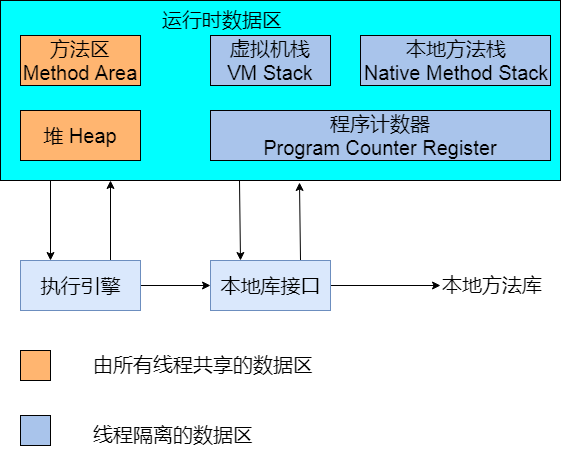

# JVM内存模型-GC算法

## JVM内存模型



JVM内存模型

- 程序计数器

  程序计数器是众多变成语言都共有的一部分,作用是标示下一条需要执行的指令的位置,分支,循环,跳转,异常处理,线程恢复等基础功能都是依赖程序计数器完成的.

  对于java的多线程程序而言,不同的线程都是通过轮流获得的cpu的时间片运行的,这符合计算机组成原理的基本概念,因此不同的线程之间需要不停的获得运行,挂起等待运行,所以各线程之间的计数器互不影响,独立存储..这些数据区属于线程私有的内存

- Java虚拟机栈

  VM虚拟机栈也是线程私有的,生命周期与线程相同.虚拟机栈描述的是java方法执行的内存模型:每个方法在执行的同时都会创建一个栈帧(stack Frame)用于存储局部变量表,操作数栈,动态链接,方法出口等信息.每一个方法调用直至执行完的过程,就对应着一个栈帧在虚拟机栈中入栈到出栈的过程.

  有人将java内存区域划分为栈与堆两部分,在这种粗略的划分下,栈标示的就是当前讲的虚拟机栈,或者是虚拟机栈对应的局部变量表.之所以说这种划分比较粗略是角度不同,这种划分方法关心的是新申请内存的存在空间,而我们目前谈论的是JVM整体的内存划分,由于角度不同,所以划分不同,没有对与错.

  局部变量表存放了编译器可知的各种基本类型,对象引用,和returnAddress.其中64位长的long和double占用了2个局部变量空间slot,其他类型都占用1个.这也从存储的角度上说明了long与double本质上的非原子性.局部变量表所需的内存在编译期间完成分配,当进入一个方法时,这个方法在栈帧中分配多大的局部变量空间是完全确定的,在方法运行期间不会改变局部变量表大小.

  由于栈帧的进出栈,显而易见的带来了空间分配上的问题.如果线程请求的栈深度大于虚拟机所允许的深度,将抛出StackOverFlowError异常;如果虚拟机栈可以扩展,扩展时无法申请到足够的内存,将会抛出OutOfMemoryError.显然,这种情况大多数是由于循环调用与递归带来的..

- 本地方法栈

  本地方法栈与虚拟机栈的作用十分类似,不过本地方法是为native方法服务的.部分虚拟机直接将本地方法栈与虚拟机栈合二为一.与虚拟机栈一样,本地方法栈也会抛出StackOverFlowError与OutOfMemoryError异常.

  至此,线程私有数据区域结束.

- Java堆

  Java堆是虚拟机所管理的内存中最大的一块,在虚拟机启动时创建,此块内存的唯一目的就是存放对象实例,几乎所有的对象实例都在对上分配内存.JVM规范中的描述是:所有的对象实例以及数据都要在堆上分配.但是随着JIT编译器的发展与逃逸分析技术的逐渐成熟,栈上分配(对象只存在于某方法中,不会逃逸出去,因此方法出栈后就会销毁,此时对象可以在栈上分配,方便销毁),标量替换(新对象拥有的属性可以由现有对象替换拼凑而成,就没有必要真正生成这个对象)等优化技术带来了一些变化,并非所有的对象都在堆上分配了

  当java堆上没有内存完成实例分配,并且堆大小也无法扩展时,将会抛出OutOfMemoryError异常,Java堆是垃圾收集器管理的主要区域

- 方法区

  方法区与java堆一样,是线程共享的数据区,用于存储被虚拟机加载的类信息,常量,静态变量,即时编译的代码.JVM规范将方法与堆区分开,但是HotSpot将方法区作为永久代实现.这样方便将GC分代手机方法扩展至方法区,Hotspot的垃圾收集器可以像管理java堆一样管理方法区.但是这种方向已经逐步在被hotspot替换,在java7中,已经把原本存放在方法区的字符串常量区移除

- 运行时常量

  运行时常量池是方法区的一部分.Class文件中除了有类的版本,字段,方法,接口等信息外,还有一项信息是常量池用于存放编译器生成的各种字面量和符号引用,这部分内容将在类加载后进入方法区的运行时常量池存放.

  其中,字符串常量池是属于运行时常量池的一部分,不过在hotspot虚拟机中,java7将字符串常量池移到了java堆中,

  ```java
  public class RunTimeContantPoolOOM{
      public static void main(String[] args){
          List list = new ArrayList();
          int i=0;
          while(true){
              list.add(String.valueOf(i++).intern());
          }
      }
  }
  ```

  - 在java6中,字符串常量区是在perm space中,所以讲perm space设置小一些 XX:MaxPermSize=10M很快抛出异常outOfMemoryError:perm Space

  - 在java7中,字符串常量区移到了java堆中,设置-Xms:64m,很快抛出异常

    OutOfMemoryError:java.heap.space

- 直接内存

  直接内存不是JVM运行时的数据区的一部分,也不是java虚拟机规范中定义的内存区域.java4中引入了NIO(New Input/Output)类,引入了一种基于通道与缓冲区的io方式,它可以使用native函数库直接分配堆外内存,然后通过一个存储在java中的DirectByteBuffer对象作为对这块内存的引用进行操作.这样能在一些场景中显著提高性能,因为避免了在java堆和native中来回复制数据.

## GC算法